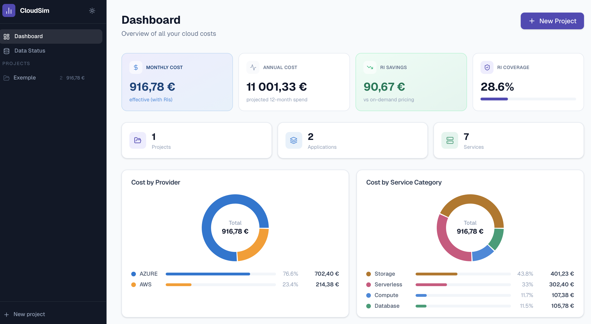
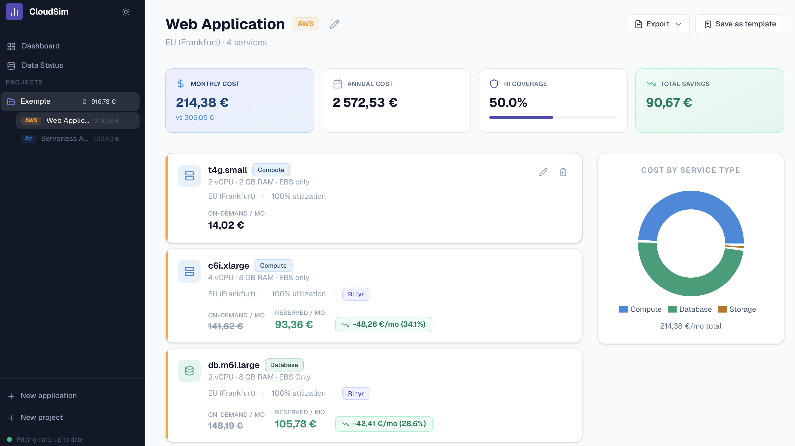
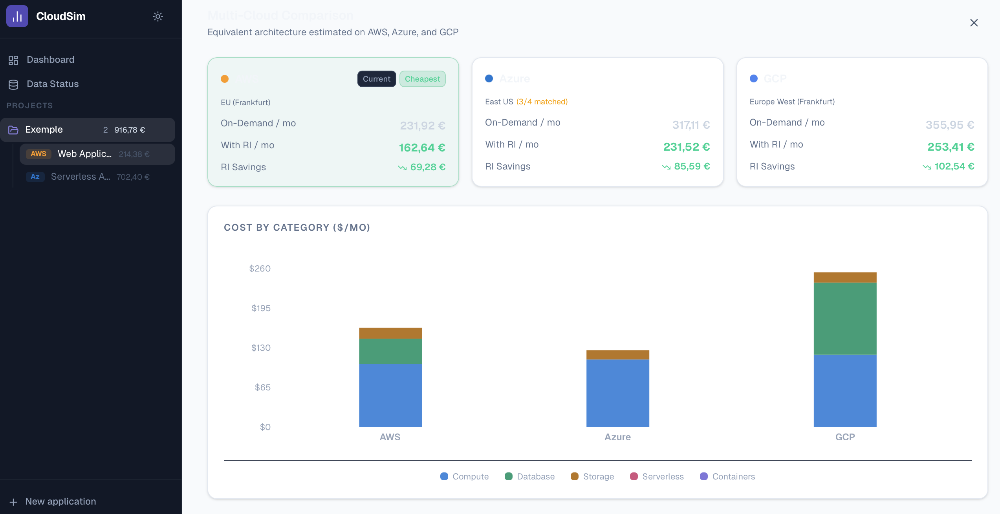
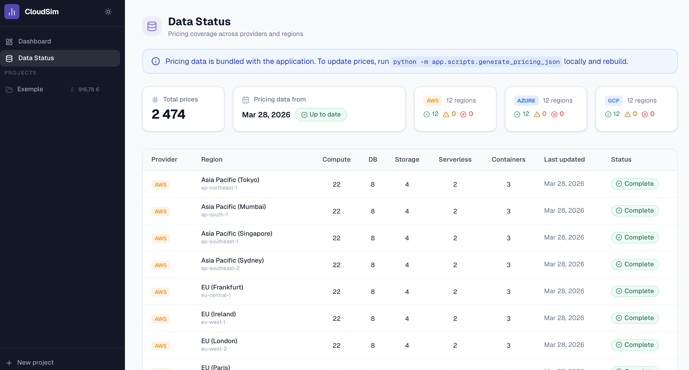

# CloudSim — Cloud Pricing Simulator

An open-source tool to estimate, compare, and optimize cloud infrastructure costs across AWS, Azure, and GCP.

Build your architecture, compare providers side by side, simulate Reserved Instance savings, and export professional cost estimates — all from a single dashboard.



## Why this tool?

Cloud pricing is fragmented across three providers, hundreds of services, thousands of SKUs, and constantly changing rates. CloudSim solves this by:

- **Pulling real prices** from AWS, Azure, and GCP public pricing APIs
- **Normalizing them** into a single schema for apples-to-apples comparison
- **Simulating costs** based on your actual architecture and usage patterns
- **Quantifying RI savings** with coverage rates and break-even analysis

## Features

**Multi-cloud cost simulation** — Compose an architecture with Compute, Database, Storage, Serverless, and Container services. Set utilization rates, volumes, request counts, and see costs update in real time.



**Provider comparison** — Same architecture, three providers. Stacked bar chart shows cost breakdown by service category across AWS, Azure, and GCP with automatic instance equivalence mapping.



**Reserved Instance modeling** — Toggle RI (1-year or 3-year) on any service and instantly see the savings vs on-demand, with global RI coverage tracking.

**Architecture templates** — Start from pre-built templates (Web App, Production HA, Data Pipeline, Microservices, Serverless API) or save your own configurations as reusable templates.

**Project organization** — Structure your estimates by Project → Application → Services. Dashboard gives a portfolio view across all projects with cost breakdowns by provider and service category.

**Export** — Generate PDF cost estimates or CSV exports for further analysis and stakeholder presentations.

**Data status monitoring** — Transparent view of pricing data coverage by provider and region, with freshness indicators.



**Dark/Light mode** — Full theme support.

## Architecture

```
┌─────────────────────────────────────────────────┐
│                  Frontend                        │
│            Next.js · TypeScript · Tailwind       │
│            shadcn/ui · Recharts                  │
└──────────────────────┬──────────────────────────┘
                       │ REST API
┌──────────────────────┴──────────────────────────┐
│                  Backend                         │
│          FastAPI · SQLAlchemy · Alembic          │
│                                                  │
│  ┌──────────────────────────────────────┐       │
│  │  Pricing JSON (static, pre-scraped)  │       │
│  │  aws_pricing.json · azure · gcp      │       │
│  └──────────────────────────────────────┘       │
└──────────────────────┬──────────────────────────┘
                       │
┌──────────────────────┴──────────────────────────┐
│              PostgreSQL 16                       │
│   providers · regions · instance_types · pricing │
│   projects · applications · services · templates │
└─────────────────────────────────────────────────┘
```

## Tech stack

| Layer | Tech |
|-------|------|
| Frontend | Next.js, TypeScript, Tailwind CSS, shadcn/ui, Recharts |
| Backend | Python 3.11, FastAPI, SQLAlchemy, Alembic, Pydantic |
| Database | PostgreSQL 16 |
| Pricing data | AWS Bulk Pricing CSV, Azure Retail Prices API, GCP (curated data) |
| Infra | Docker, Docker Compose |

## Quickstart

### Prerequisites

- [Docker Desktop](https://www.docker.com/products/docker-desktop/) installed and running

### Run

```bash
git clone https://github.com/DrilaZz/cloud-pricing-simulator.git
cd cloud-pricing-simulator
cp .env.example .env
docker compose up --build
```

Open [http://localhost:3000](http://localhost:3000).

Pricing data is bundled with the application — startup takes less than 30 seconds.

### Development (without Docker)

**Backend:**
```bash
cd backend
python -m venv .venv && source .venv/bin/activate
pip install -r requirements.txt
# Make sure PostgreSQL is running and DATABASE_URL is set
alembic upgrade head
python -m app.scripts.seed_providers
python -m app.scripts.seed_templates
python -m app.scripts.run_scrapers
uvicorn app.main:app --reload
```

**Frontend:**
```bash
cd frontend
npm install
npm run dev
```

## Updating pricing data

Pricing data is stored as static JSON files in `backend/app/data/pricing/`. To refresh with the latest prices:

```bash
cd backend
python -m app.scripts.generate_pricing_json
```

This script scrapes live pricing from AWS and Azure APIs (takes 5-10 minutes). Commit the updated JSON files and rebuild.

## Services covered

| Category | AWS | Azure | GCP |
|----------|-----|-------|-----|
| Compute | EC2 (t3, t4g, m5, m6i, m7i, c5, c6i, r5, r6i, r7i) | VMs (B, Ds_v5, Es_v5, Fs_v2) | Compute Engine (e2, n2, n2d, c2, m2) |
| Database | RDS MySQL/PostgreSQL | Azure SQL, Azure DB for MySQL/PG | Cloud SQL MySQL/PostgreSQL |
| Storage | S3 (Standard, Intelligent-Tiering, Glacier) | Blob (Hot, Cool, Archive) | Cloud Storage (Standard, Nearline, Coldline, Archive) |
| Serverless | Lambda | Azure Functions | Cloud Functions |
| Containers | EKS + Fargate | AKS | GKE |

**Regions:** US (4), Europe (4), Asia-Pacific (4) per provider — 36 regions total.

**Pricing:** On-demand + Reserved Instances (1-year and 3-year) where available.

## API reference

The backend exposes a REST API on port 8000 with auto-generated Swagger docs at `/docs`.

Key endpoints:

| Method | Endpoint | Description |
|--------|----------|-------------|
| GET | `/api/dashboard` | Global cost summary |
| GET | `/api/providers` | List providers |
| GET | `/api/providers/{id}/instance-types` | Instances by provider (filterable by region) |
| GET | `/api/pricing/compare` | Multi-cloud cost comparison |
| GET | `/api/templates` | List architecture templates |
| POST | `/api/projects` | Create a project |
| POST | `/api/projects/{id}/applications/from-template` | Create app from template |
| GET | `/api/applications/{id}/export-pdf` | Export cost estimate as PDF |
| GET | `/api/applications/{id}/export-csv` | Export cost estimate as CSV |
| GET | `/api/data-status` | Pricing data coverage and freshness |

## Project structure

```
cloud-pricing-simulator/
├── frontend/                # Next.js app
│   ├── app/                 # Pages and routing
│   ├── components/          # UI components
│   ├── lib/                 # API client, utils
│   └── Dockerfile
├── backend/                 # FastAPI app
│   ├── app/
│   │   ├── api/routes/      # REST endpoints
│   │   ├── models/          # SQLAlchemy models
│   │   ├── schemas/         # Pydantic schemas
│   │   ├── scrapers/        # AWS, Azure, GCP scrapers
│   │   ├── scripts/         # Seed, scrape, and generate scripts
│   │   ├── data/
│   │   │   ├── pricing/     # Static pricing JSON files
│   │   │   └── default_templates.py
│   │   └── utils/           # Region mapping, helpers
│   ├── alembic/             # DB migrations
│   └── Dockerfile
├── docker-compose.yml
├── .env.example
└── README.md
```

## Roadmap

- [ ] Real GCP pricing API integration
- [ ] Cost forecasting with growth projections
- [ ] Optimization recommendations (rightsizing, RI suggestions)
- [ ] Terraform import (parse .tf files to auto-populate architectures)
- [ ] User authentication and shared projects
- [ ] Live demo deployment

## Author

**Paul Ouartsi** — FinOps Expert | Data Engineer

Specialized in multi-cloud cost optimization (AWS, Azure) with experience at TotalEnergies (500+ applications, ~20% annual cost reduction) and Amazon.

- [LinkedIn](https://www.linkedin.com/in/paulouartsi)
- [Email](mailto:ouartsi.paul@gmail.com)

FinOps Certified Practitioner | FinOps Certified FOCUS Analyst

## License

MIT
